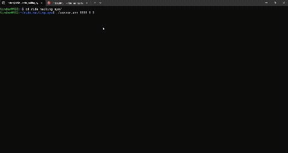
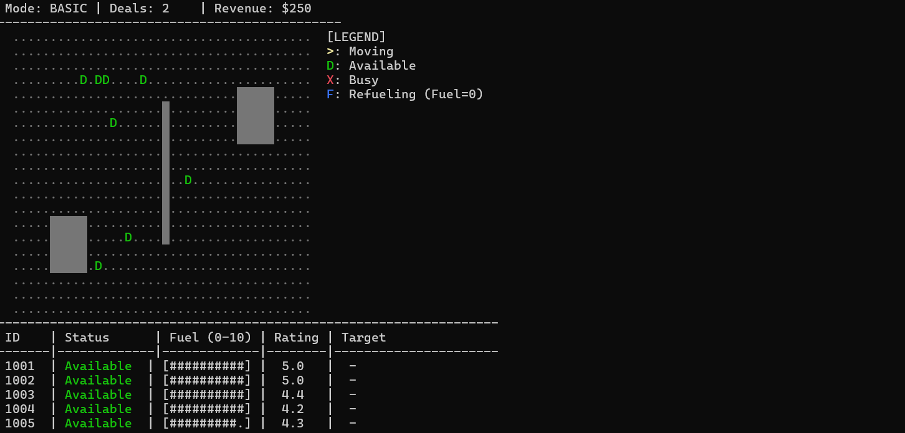
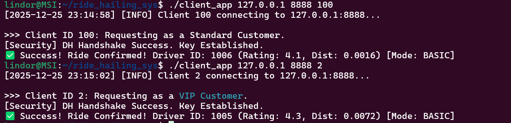
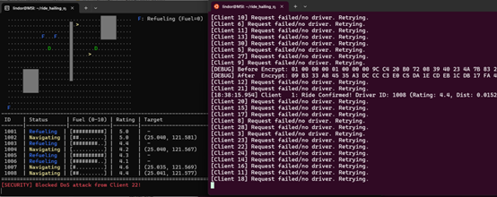
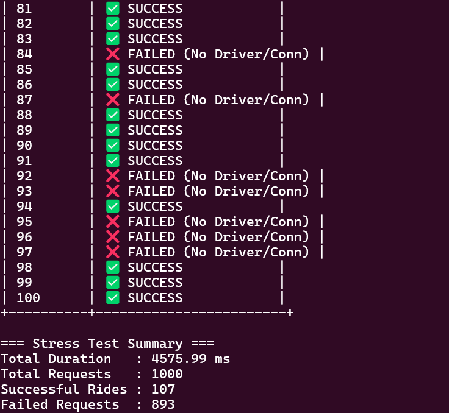
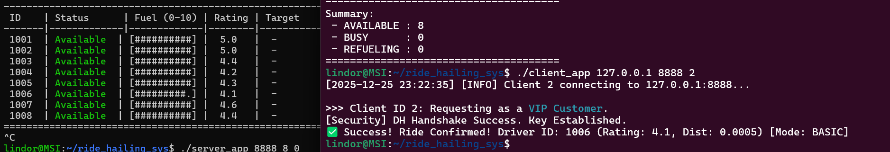
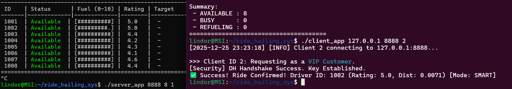

# 🚖 Smart City Ride-Hailing System


A high-performance, secure, and robust ride-hailing server implementation using **Linux System Programming**.
This project demonstrates advanced OS concepts including **Pre-forking Process Pools**, **POSIX Shared Memory IPC**, and **Hybrid Encryption (RC4 + Diffie-Hellman)**.

---

## 📖 Table of Contents
- [Background](#-background)
- [Key Features](#-key-features)
- [System Architecture](#-system-architecture)
- [File Structure](#-file-structure)
- [Installation & Build](#-installation--build)
- [Usage](#-usage)
- [Technical Details](#-technical-details)
- [Team](#-team)

---

## 🏙 Background
In modern smart cities, ride-hailing services must handle thousands of concurrent requests with low latency. Traditional single-process architectures often fail under such load. 

This project solves these challenges by implementing a **Multi-Process Server** that eliminates the runtime overhead of `fork()` and ensures data consistency across processes using robust synchronization mechanisms.

---

## 🚀 Key Features

### 🏗️ High-Performance Architecture
* **Pre-forking Process Pool:** Pre-allocates a fixed number of worker processes (Dispatchers) to handle connections, minimizing context switching overhead.
* **High Concurrency:** Capable of handling hundreds of concurrent connections (verified via Stress Testing).

### 🔄 Inter-Process Communication (IPC)
* **Shared Memory (`mmap`):** Zero-copy data sharing between the Master and Worker processes.
* **Process-Shared Mutex:** Implements `PTHREAD_PROCESS_SHARED` mutexes to prevent Race Conditions on global driver states.

### 🔐 Security & Reliability
* **Hybrid Cryptosystem:** 
    * **Diffie-Hellman:** Secure Key Exchange (Handshake).
    * **RC4 Stream Cipher:** Fast encryption for real-time data transmission.
* **Integrity Check:** Custom Checksum implementation to detect packet tampering.
* **DoS Protection:** Rate limiting and blacklist mechanism for malicious IPs.

### 🗺️ Algorithmic Logic
* **A* Pathfinding:** Simulates realistic driver navigation and obstacle avoidance.
* **Smart Matching:** Prioritizes 5-star drivers for VIP clients (Smart Mode) vs. Proximity-based matching (Basic Mode).

---

## 🏛 System Architecture

The system follows a **Master-Worker** pattern with a shared data layer.

```text
+---------------------+      +------------------------------------------+
|     Client Side     |      |               Server Side                |
+---------------------+      +------------------------------------------+
|  [Client 1 (VIP)]   | ---> |  +------------------------------------+  |
+---------------------+      |  |   Network Security Layer (TCP)     |  |
|  [Client 2 (Std)]   | ---> |  | (RC4 Encryption / DH Key Exchange) |  |
+---------------------+      |  +------------------+-----------------+  |
|  [Client N ...]     | ---> |                     |                    |
+---------------------+      |          (Load Distribution)             |
                             |                     |                    |
                             |  +------------------v-----------------+  |
                             |  |  Master Process (System Manager)   |  |
                             |  +------------------+-----------------+  |
                             |                     | (fork)             |
                             |         +-----------+-----------+        |
                             |         |           |           |        |
                             |  +------v-----+ +---v-------+ +-v------+ |
                             |  | Dispatcher | | Dispatcher| | Dispatcher||
                             |  |  Process 1 | | Process 2 | | Process N ||
                             |  +------+-----+ +---+-------+ +-----+----+ |
                             |         |           |               |      |
                             |         v           v               v      |
                             |  +------------------------------------+  |
                             |  |           IPC Layer                |  |
                             |  | (POSIX Shared Memory + Mutex Lock) |  |
                             |  +------------------------------------+  |
                             +------------------------------------------+
```

## 📂 File Structure
```text
.
├── Makefile                   # Automated build script
├── README.md                  # Project documentation
├── server_app                 # Compiled Server executable
├── client_app                 # Compiled Client executable
├── stress_test                # Compiled Stress Test executable
│
├── src/
│   ├── common/                # [Shared Library]
│   │   ├── include/           # Header files (protocol.h, shared_data.h)
│   │   ├── net_wrapper.c      # Socket wrappers (recv_n, timeouts)
│   │   ├── protocol.c         # Packet serialization & Checksum
│   │   └── dh_crypto.c        # RC4 & Diffie-Hellman implementation
│   │
│   ├── server/                # [Server Core]
│   │   ├── server_main.c      # Entry point, IPC init, Fork Pool
│   │   ├── dispatcher.c       # Worker logic, Handshake, Decryption
│   │   ├── ride_service.c     # Ride matching logic (Basic/Smart)
│   │   └── map_monitor.c      # A* Pathfinding & Visualization
│   │
│   └── client/                # [Client App]
│       ├── client_main.c      # Client entry point
│       ├── client_core.c      # Client state machine
│       └── stress_client.c    # Multi-threaded stress testing tool
```

## 🛠 Installation & Build
Prerequisites
Linux Environment (Ubuntu / WSL2 recommended)

GCC Compiler

Make

Build Steps
Clone the repository and compile using `make`:
```bash
# Clean previous builds
make clean

# Compile all components (Server, Client, Stress Test)
make
```

## 💻 Usage
### 🎥 Demo


1. Start the Server
Run the server with the specified port, number of worker processes, and dispatch mode.
```bash
# Usage: ./server_app <port> <worker_count> <dispatch_mode>
# dispatch_mode: 0 = Basic (Distance), 1 = Smart (Rating/VIP)

./server_app 8888 8 0
```

2. Start a Client
Run a client to interact with the server.
```bash
# Usage: ./client_app <server_ip> <port> <client_id>
# client_id: 1~10 = VIP User, others = Normal User

./client_app 127.0.0.1 8888 1
```
Server Single Test Result



3. Run Stress Test
Simulate high concurrency to test server stability.
```bash
# Usage: ./stress_client <server_ip> <port> <concurrent_requests>

./stress_client 127.0.0.1 8888 100
```
Server Stress Test Result



4. Dispatching Algo Test
Compare two dispatching Algo .
```bash
# Usage: ./client_app <server_ip> <port> <client_id>
# client_id: 1~10 = VIP User

./client_app 127.0.0.1 8888 1
```
Dispatching Test Result



## 🔧 Technical Details
Protocol Design
To solve TCP Sticky Packets, we utilize a length-prefix binary protocol: `[ Length (4B) ] [ Type (4B) ] [ OpCode (2B) ] [ Checksum (2B) ] [ Payload... ]`

Security Handshake Flow
Connect: Client connects to Server.

Handshake: Client sends DH Public Key.

Negotiation: Server computes Shared Secret & Session Key.

Transport: All subsequent RIDE_REQ packets are encrypted using RC4 with the Session Key.

## 👥 Team
114368064 謝欣蓉:Core Server Architecture, IPC Management, Ride Matching Logic (Basic/Smart), System Integration

114368008 温予宣:Security and Attack Simulation
(insecure_dispatcher.c,insecure_server.c,dh_crypto.c,malicious_client.c)

Course Project for Network Systems Programming and Security
